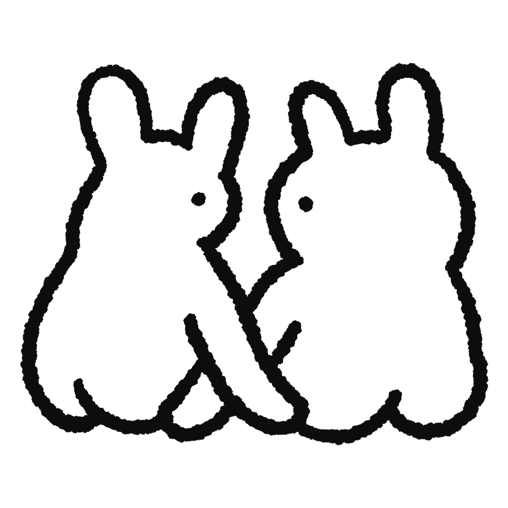

# Decanter

Decanter plays Windows games on a Mac. You add a game's `.exe` and press Play.

It uses [Wine](https://www.winehq.org) to run the games. Decanter downloads Wine and sets it up for you, so you don't need to know anything about it.

## Getting started

1. Open Decanter and click **Download Wine**. It's about 260 MB and you only do it once. On a Mac with Apple Silicon, Decanter also asks to install Rosetta 2 if you don't have it.
2. Add a game. Drag its `.exe` onto the window, click **+**, or right-click the `.exe` in Finder and choose Open With → Decanter.
3. Press **Play**. The first time takes about a minute while Decanter gets things ready.
4. To quit a game, press **⌘Q** while you're playing it. Quitting Decanter quits any games that are still running too.

If a game comes as an installer (`setup.exe` or a `.msi` file), add that instead. Decanter runs the installer, then asks which game to add.

Some games come with extra installers for sound or for Microsoft's Visual C++, sitting next to the game. Decanter runs those for you the first time you play.

## Which games work

Decanter is made for indie games. These kinds of games have been tested and work, with sound, keyboard and mouse:

- Unity games, from old ones to Unity 6
- Godot games, versions 3 and 4
- GameMaker games, from GameMaker 8 to today's GameMaker
- Ren'Py visual novels
- RPG Maker MV games
- LÖVE games
- Clickteam Fusion games
- MonoGame games
- other games built on SDL, such as small C# engines

Old 32-bit Unity games can take half a minute or more to load. Give them time.

Games that usually won't work:

- games with anti-cheat
- games that need Steam or another launcher running
- newer Construct games that ask to install Microsoft Edge WebView2
- big 3D games that need DirectX 12

## When a game doesn't work

Decanter decides how to run each game by itself. If a game closes or crashes as it starts, Decanter tries another way and remembers the one that works.

You can also choose yourself, under the game's Options:

- **Wine engine.** Decanter has two versions of Wine.
- **Graphics.** Two ways of drawing games made with DirectX 10 or 11, which includes most Unity games. If a game shows a black screen or looks wrong, try the other one.
- **Run inside a window.** For games that open at the wrong size or change your screen resolution.
- **Launch options.** Extra settings to start the game with, if the game's instructions mention any.

Choosing the engine or graphics yourself turns off **Choose automatically** for that game. Turn it back on to let Decanter decide again.

**Log**, under the options, shows what Wine printed while the game ran. Click it to open it, and copy it if you're asking someone for help.

The Settings window (⌘,) has Wine's own settings, a way to see the game's C: drive in Finder, and a button to force-quit everything.

## Updates

Decanter checks for a new version when you open it, once a day, and tells you when there is one. To check straight away, choose Decanter → Check for Updates….

## Where Decanter keeps things

Everything is in `~/Library/Application Support/Decanter/`:

- `library.json`: your list of games
- `Engines/` and `Wine/`: the two versions of Wine
- `Prefix-CrossOver/` and `Prefix/`: a Windows C: drive for each version of Wine, including any saves games keep there
- `Icons/`: icons taken from each game

## For developers

You need the Xcode Command Line Tools (Swift 5.9 or later) on macOS 14 or later.

```
./build.sh              # quick build for this Mac → build/Decanter.app
./build.sh --notarise   # signed and notarised → dist/
./build.sh --release    # notarised, then published as a GitHub release
```

[RELEASING.md](RELEASING.md) explains signing, notarising and publishing updates.

The code is in `Sources/Decanter/`:

- `Wine.swift`: finding, downloading and running Wine
- `AppModel.swift`: the game library, launching games, installers
- `Views.swift`: the windows and buttons
- `Setup.swift`: choosing the engine and graphics for each game
- `Updates.swift`: checking for new versions
- `PEIcon.swift`: reading icons out of `.exe` files

The two versions of Wine are CrossOver 24, built by the [Sikarugir](https://github.com/Sikarugir-App) project (the default), and Wine Staging, from [Gcenx's builds](https://github.com/Gcenx/macOS_Wine_builds).
